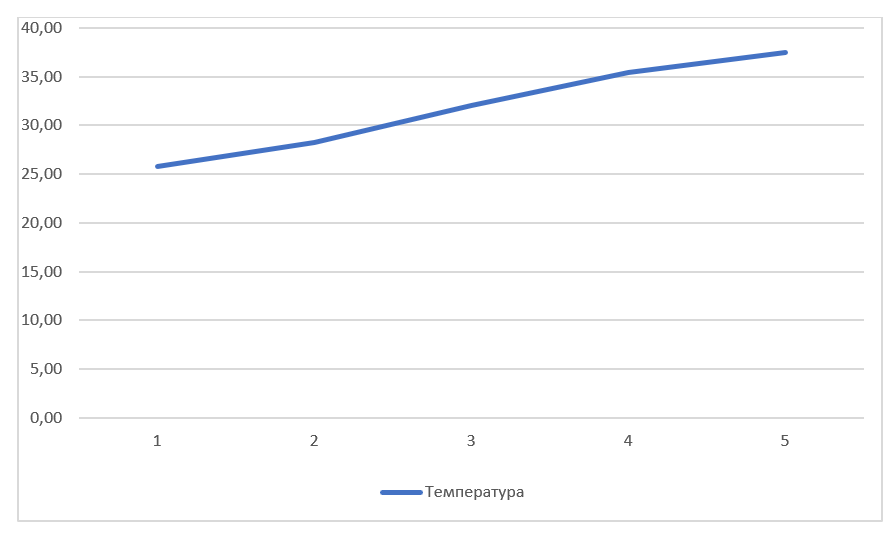
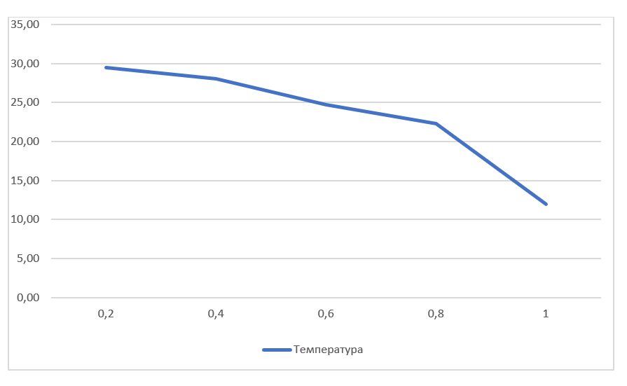
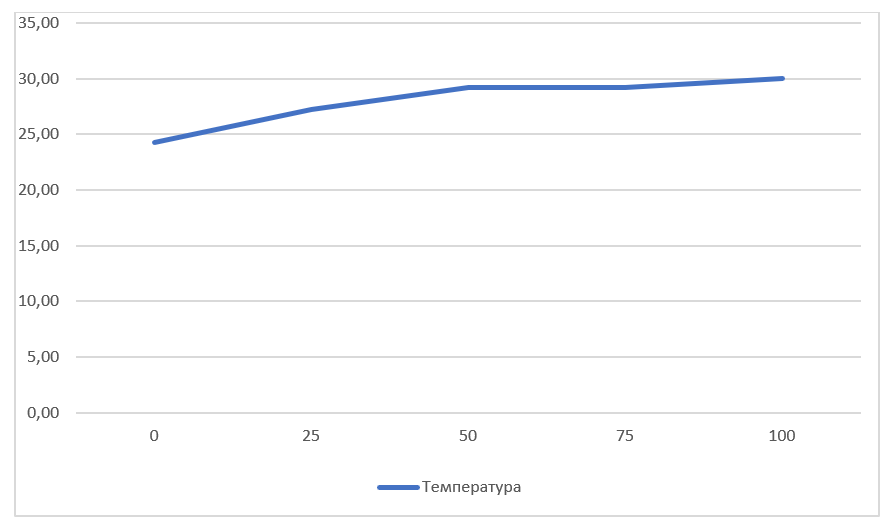

## Комп'ютерні системи імітаційного моделювання
## СПм-22-5, Штепа Дем'ян
### Лабораторна робота №**1**. Опис імітаційних моделей та проведення обчислювальних експериментів

 

### Варіант 2, модель у середовищі NetLogo:
[Climate Change](http://www.netlogoweb.org/launch#http://www.netlogoweb.org/assets/modelslib/Sample%20Models/Earth%20Science/Climate%20Change.nlogo)

 

### Вербальний опис моделі:

Ця модель ілюструє енергетичний потік на Землі, зокрема теплову енергію, враховуючи вплив сонячного світла, хмар, та парникових газів, зокрема CO2. Вона показує, як сонячна енергія поглинається Землею,
перетворюючись на тепло, і як це тепло виражається червоними точками, які рухаються навколо планети. Температура Землі пов'язана з кількістю цих точок, і вони також можуть стати інфрачервоним світлом,
яке виходить в космос і забирає з собою енергію. Модель ілюструє, як парниковий ефект зумовлений поглинанням ІЧ випромінюванням CO2 та іншими газами.

### Керуючі параметри:
- **sun-brightness:** параметр визначає, наскільки сильним є сонячне випромінювання, яке надходить на Землю. Збільшення яскравості сонця призводить до більшого потоку сонячної енергії, що може вплинути на температуру планети.
- **albedo:** вказує, наскільки світло відбивається від поверхні Землі. Високий альбедо вказує на більше відбивання сонячної енергії, що може призвести до охолодження планети, тоді як низький альбедо означає більше поглинання енергії та нагрівання.
- **add-cloud:** визначає можливість додавання хмар до атмосфери моделі. Хмари можуть впливати на відбиття сонячної енергії та блокування інфрачервоного випромінювання, що впливає на розподіл енергії на Землі.
- **add-CO2:**  дозволяє додавати молекули діоксиду вуглецю (CO2) до атмосфери моделі. CO2 є парниковим газом і може поглинати інфрачервоне світло, що випромінюється Землею. Додавання CO2 може вплинути на парниковий ефект і температуру планети.

### Внутрішні параметри:
- **sky-top**. Цей параметр визначає вертикальну координату верхнього рядка неба в моделі. 
- **earth-top**.  Цей параметр визначає вертикальну координату верхнього рядка Землі в моделі. Він вказує на межу між поверхнею Землі та атмосферою.
- **temperature**. Цей параметр представляє загальну температуру Землі в моделі. Він відображає стан теплової енергії на планеті та може бути визначеним на основі кількості червоних точок в моделі.
- **cloud-speed**. Цей параметр вказує на швидкість руху хмар в атмосфері. 
- **cloud-id**. Цей параметр є ідентифікатором конкретної хмари в моделі. Він може використовуватися для відстеження та управління конкретними хмарами в системі.

### Показники роботи системи:
- Графік глобальної температури на планеті за весь час симуляції.
- Значення температури в даний момент.
- Кількість CO2 в атмосфері в даний момент..

### Примітки:
- Початкова температура Землі завжди 12 градусів.
- Хмари насправді складаються з безлічі маленьких круглих *turtles*(агентів черепах).
- Якщо сонячне світло поглинається землею, воно перетворюється на червону крапку, що символізує теплову енергію. Кожна крапка представляє енергію однієї жовтої сонячної стріли. Червоні крапки хаотично рухаються навколо землі, а її температура залежить від загальної кількості червоних точок.
- Іноді червоні крапки перетворюються на інфрачервоне (ІЧ) світло, яке спрямовується в космос, несучи енергію. Імовірність того, що червона точка стане інфрачервоним світлом, залежить від температури землі.
  
### Недоліки моделі:
- Немає можливості вказувати початкову кількість хмар. Лише по одній за допомогою кнопки. І на початку симуляції взагалі немає хмар. Те ж саме з CO2.
- Сонечні промені падають по доволі простій траекторії. Мається на увазі, що проходять дні і місяці, а промені завжди падають в одному напрямку. Це доволі нереалістично.
- В симцуляції немає зміни дня та ночі. Хоча це сильно впливає на нагрів атмосфери в реальному світі.

 

## Обчислювальні експерименти
### 1. Вплив яскравості Сонця на температуру Землі.
Досліджується вплив яскравості сонця на температуру землі. Береться значення температури, якого може досягти Земля за певний період часу (3000 тіків).
Експерименти проводяться при 1.0-5.0 рівнях яскравості Сонця, з кроком 1, усього 5 симуляцій.  
Інші керуючі параметри мають значення за замовчуванням:
- **albedo**: 0.6
- **CO2 amount**: 0
- **cloud amount**: 0

<table>
<thead>
<tr><th>Яскравість Сонця</th><th>Температура</th></tr>
</thead>
<tbody>
<tr><td>1</td><td>25,8</td></tr>
<tr><td>2</td><td>28,2</td></tr>
<tr><td>3</td><td>32,0</td></tr>
<tr><td>4</td><td>35,4</td></tr>
<tr><td>5</td><td>37,5</td></tr>
</tbody>
</table>

Графік наочно показує, що якщо яскравість Сонця зростає від 1 до 5, температура Землі також зростає з часом все більше. Це підтверджує, що сонячна активність має великий вплив на температуру планети.

### 2.  Вплив рівня альбедо землі на температуру Землі.
Досліджується вплив рівня альбедо землі на температуру Землі. Береться значення температури, якого може досягти Земля за певний період часу (3000 тіків).
Експерименти проводяться при 0.2-1.0  значеннях альбедо, з кроком 0.2, усього 5 симуляцій.  
Інші керуючі параметри мають значення за замовчуванням:
- **sun-brightness**: 1.0
- **CO2 amount**: 0
- **cloud amount**: 0

<table>
<thead>
<tr><th>Значення альбедо</th><th>Температура</th></tr>
</thead>
<tbody>
<tr><td>0,2</td><td>29,5</td></tr>
<tr><td>0,4</td><td>28,0</td></tr>
<tr><td>0,6</td><td>24,7</td></tr>
<tr><td>0,8</td><td>22,3</td></tr>
<tr><td>1,0</td><td>12,0</td></tr>
</tbody>
</table>

Графік наочно показує, що зі збільшенням рівня альбедо (з 0,2 до 1,0), температура Землі знижується. Це свідчить про те, що поверхня Землі, яка відбиває більше сонячної енергії, стає холоднішою, адже поглинає менше тепла від сонця.

### 3. Вплив кількості CO2 в атмосфері на температуру Землі.
Досліджується вплив кількості CO2 в атмосфері на температуру Землі. Береться значення температури, якого може досягти Земля за певний період часу (3000 тіків).
Експерименти проводяться при 0-100  значеннях CO2 в атмосфері, з кроком 25, усього 5 симуляцій.  
Інші керуючі параметри мають значення за замовчуванням:
- **sun-brightness**: 1.0
- **albedo**: 0.6
- **cloud amount**: 0

<table>
<thead>
<tr><th>кількості CO2</th><th>Температура</th></tr>
</thead>
<tbody>
<tr><td>0</td><td>24,3</td></tr>
<tr><td>25</td><td>27,2</td></tr>
<tr><td>50</td><td>29,2</td></tr>
<tr><td>75</td><td>29,4</td></tr>
<tr><td>100</td><td>30,0</td></tr>
</tbody>
</table>

Графік наочно показує, що зростання кількості CO2 в атмосфері призводить до збільшення температури. Але збільшення кількості CO2 від 0 до 25 одиниць призвело до збільшення температури на 2,9 градуса Цельсія, тоді як збільшення від 75 до 100 одиниць призвело лише до зростання на 0,6 градуса Цельсія за той період часу.
